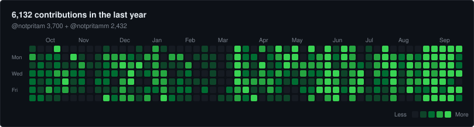

<h1 align="center">Pritam Sharma</h1>

<b>Builder at core, engineer by craft</b>

  Founding software engineer at <a href="https://emergent.sh"><b>Emergent</b></a> <code>YC S24</code> · Bangalore, India

  
  
  
  

  Two accounts, one person — <a href="https://github.com/notpritam"><b>@notpritam</b></a> (personal) and <a href="https://github.com/notpritamm"><b>@notpritamm</b></a> (day job). <a href="#-activity">Merged graph below.</a>

---

## `// about`

I build calm, fast products — from scratch and at scale.

Right now I'm a **founding software engineer at [Emergent](https://emergent.sh) (YC S24)**, the AI app
builder that went from YC Demo Day to a **$1.5B valuation in ~14 months** — $130M Series C (Jul 2026),
$120M annual run-rate, 200K+ paying customers, India's 6th unicorn of 2026.

I own the frontend there. For most of the foundation phase that meant **one of two people** carrying
every product surface, shipping **3–4 features a day**.

- 🧱 &nbsp;3+ years shipping production · 12+ products end-to-end · millions of users reached
- 🤖 &nbsp;Most of what I build now is **AI product engineering** — LLM apps, agents, and the tooling around them
- 🌏 &nbsp;Bangalore, India · IST (UTC+5:30) · he/him
- 🤝 &nbsp;Open to interesting collaborations — [say hi](https://notpritam.in)

## `// what I've shipped at Emergent`

| | |
|---|---|
| **Core chat experience** | Rebuilt it and shipped to production in a week with zero functional regressions |
| **Emergent mobile** | Sole developer — ported the full web platform to React Native + Expo, driving **$20K+/day** |
| **Performance** | Cut page load from **7s → under 1s** |
| **Light theme** | Drove a **+15% conversion lift** and measurably better retention |
| **Landing page editor** | JSON → static HTML. Compressed 1–2 week marketing cycles to **20 minutes**, pages served in 0.3s |
| **Visual Edit Mode** | Customize your app without AI — no credits burned. Working POC in **1 day** |
| **AI PR review system** | Self-learning feedback loop — review turnaround **2h → 20min** |
| **Design system** | Automated it so designers ship UI fixes themselves, with zero engineering involvement |

## `// featured work`

| Project | What it is | Stack |
|---|---|---|
| **[personae](https://github.com/notpritam/personae)** | AI avatar platform — autonomous personas on Instagram, Telegram & X, with voice and face generation | `React` `Hono` `Claude API` `ElevenLabs` |
| **[forge](https://github.com/notpritam/forge)** | Self-improving AI video pipeline — stage-gated, 5 renderers, 130+ viral rules distilled from 35+ sources | `Remotion` `Manim` `Three.js` `FFmpeg` |
| **[lorekeeper](https://github.com/notpritam/lorekeeper)** | AI story workbench — versioned character state and knowledge matrices for narrative consistency | `React` `Hono` `Claude CLI` |
| **[caseboard](https://github.com/notpritam/caseboard)** | Multiplayer AI mystery game — tool-use evidence reveal, real-time SSE streaming | `React` `Claude SDK` `SSE` |
| **[limpet](https://github.com/notpritam/limpet)** | Run your Mac off an external SSD with automatic local failover and conflict-safe merge-back. Single-file bash, no kext, no daemon | `Shell` |
| **[daylog](https://github.com/notpritam/daylog)** | Mirrors every Claude Code session into Obsidian — daily notes, rollups, 8-axis auto-tagging | `Python` |
| **[beacon](https://github.com/notpritam/beacon)** | Gives a cloud agent safe, durable control of your laptop — MCP + queue | `Go` |
| **[myCodeJudge](https://github.com/notpritam/myCodeJudge)** ⭐ 42 | LeetCode-style online judge — multi-language execution with sandboxed server safety | `TypeScript` `Docker` |

I also write and maintain agent skills — [explanimate](https://github.com/notpritam/explanimate)
(animated React explainers rendered to video), [claude-canvas](https://github.com/notpritam/claude-canvas)
(interactive React Flow diagrams), and [cmux](https://github.com/notpritam/cmux) (a Ghostty-based
terminal built for running AI coding agents).

## `// stack`

**Frontend**

    

**Mobile & Desktop**

   

**Backend & Data**

      

**AI**

  

**Infra & Tooling**

    

## `// writing`

- [**How We Built a No-Code Landing Page Editor That Ships Static Pages in Minutes**](https://notpritam.in) — we automated ourselves out of changing hex codes for a living
- [**Award Winning Marquee Animation with Framer Motion**](https://notpritam.in) — building a smooth, performant marquee

More at [notpritam.in](https://notpritam.in).

## `// activity`

I ship from two GitHub accounts. **Both are me:**

| Account | Used for | What lives there |
|---|---|---|
| **[@notpritam](https://github.com/notpritam)** | personal | side projects, agent skills, open source — you're on it |
| **[@notpritamm](https://github.com/notpritamm)** | day job | Emergent production work |

GitHub won't merge contribution graphs across accounts, so I merge them myself — this one is
generated daily from both calendars, summed day by day:

<picture>
  <source media="(prefers-color-scheme: dark)" srcset="./assets/contributions-dark.svg">
  <source media="(prefers-color-scheme: light)" srcset="./assets/contributions-light.svg">
  
</picture>

<!-- STATS:START -->

      

<!-- STATS:END -->

Most of it is private — Emergent's product surfaces don't show up as green squares with repo names
attached, but they're the bulk of the work.

**Latest public pushes** — the private half doesn't show up here:

<!-- RECENT:START -->
| Repo | What | When |
|---|---|---|
| **[bug-finder](https://github.com/notpritam/bug-finder)** | pushed to `main` | 4m ago |
| **[be10x](https://github.com/notpritam/be10x)** | pushed to `main` | 20d ago |
| **[limpet](https://github.com/notpritam/limpet)** | pushed to `main` | 28d ago |
<!-- RECENT:END -->

---

<!-- QUOTE:START -->
> *The road to production is paved with 'it works on my machine.'*
>
> — **Anonymous**
<!-- QUOTE:END -->

Graph, stats and quote refresh themselves every morning via
[a GitHub Action](./.github/workflows/contrib-graph.yml). Nothing on this page is typed by hand twice.
